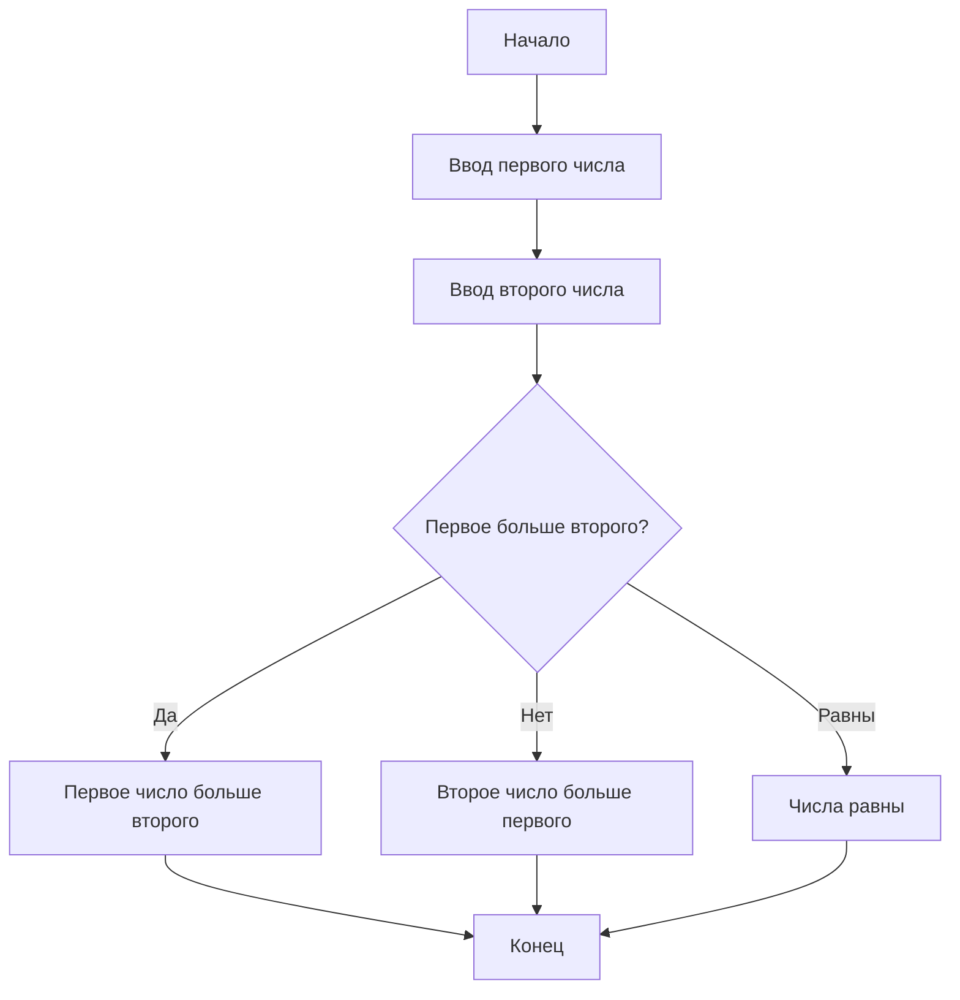

Министерство науки и высшего образования Российской Федерации Федеральное государственное бюджетное образовательное учреждение высшего образования Уфимский университет науки и технологий

Кафедра АСУ

Отчет по лабораторной работе №3 по дисциплине «Основы современных цифровых технологий и искусственного интеллекта» на тему «Диаграмма как код»

Выполнил: ст. гр. ИВТ-ИСУ-102б Якорева У. Д.

Уфа-2024

**Задание 1**

Алгори́тм (лат. algorithmi — от имени среднеазиатского математика Аль-Хорезми[1]) — совокупность точно заданных правил решения некоторого класса задач или набор инструкций, описывающих порядок действий исполнителя для решения определённой задачи. В старой трактовке вместо слова «порядок» использовалось слово «последовательность», но по мере развития параллельности в работе компьютеров слово «последовательность» стали заменять более общим словом «порядок». Независимые инструкции могут выполняться в произвольном порядке, параллельно, если это позволяют используемые исполнители.

Термин "алгоритм" появился благодаря трудам Аль-Хорезми, который в своих произведениях описывал арифметические операции. В Европе его имя трансформировалось в "algorithmi", что стало обозначать методы вычислений. В XVII веке понятие алгоритма расширилось до последовательности действий для решения математических задач. Формальное определение алгоритма было предложено в 1936 году Аланом Тьюрингом, который ввел концепцию универсальной вычислительной машины, что стало основой для теории алгоритмов и вычислимости. С тех пор алгоритмы стали ключевым понятием в информатике и математике, охватывая широкий спектр методов и процедур для решения задач.

**Задание 2**

Блок-схема — это графическое представление алгоритма или процесса, где отдельные шаги отображаются в виде блоков, соединённых линиями, указывающими направление последовательности. Основные элементы блок-схемы включают:
1. Прямоугольник: обозначает действие или процесс.
2. Ромб: используется для условий, где происходит ветвление (например, "да" или "нет").
3. Параллелограмм: указывает на ввод или вывод данных.
4. Овал: обозначает начало и конец алгоритма.
5. Две параллельные линии: символизируют параллельные действия.

**Задание 3**
Использую чат-бот Perplexity.
Промт: Ответь кратко на вопрос: Когда «блок-схемы алгоритмов» стали называть
«схемы алгоритмов» и почему? 
Ответ: Термин «схемы алгоритмов» стал использоваться вместо «блок-схемы алгоритмов» в результате расширения применения графических представлений алгоритмов за пределами традиционных блок-схем. Это связано с тем, что схемы могут включать различные виды графиков и диаграмм, которые не ограничиваются только блоками, но также могут включать другие визуальные элементы и нотации, в зависимости от специфики задачи или области применения.
С изменением подходов к визуализации процессов и алгоритмов, возникла необходимость использовать более универсальный термин, который отражает разнообразие представлений, таких как функциональные схемы, схемы процессов и бизнес-процессы

**Задание 4**

ГОСТ 19.701-90 — «Схемы алгоритмов, программ, данных и систем. Условные обозначения и правила выполнения». Этот стандарт описывает условные обозначения для схем алгоритмов и программ, а также правила их выполнения. Он введен в действие с 1 января 1992 года и соответствует международному стандарту ISO 5807:1985 3.

**Задание 5**
Использую чат-бот Perplexity.
Промт:Ответь кратко: Что такое Workfow Diagram и есть ли здесь какая-то связь
со схемой алгоритма Flowchar?
Ответ: Workflow Diagram — это визуальное представление бизнес-процесса, которое отображает последовательность шагов, необходимых для выполнения задачи от начала до конца. Эти диаграммы используют стандартизированные символы и формы для обозначения действий, решений и потоков информации125.
Связь между Workflow Diagram и схемой алгоритма Flowchart заключается в том, что обе используют графические элементы для отображения процессов. Flowchart является одним из типов Workflow Diagram и служит для визуализации последовательности действий и принятия решений в рамках процесса. Оба типа диаграмм помогают выявлять узкие места и улучшать эффективность работы.

**Задание 6**

**Задание 7**

Слово "terminator" происходит от латинского terminator, что означает "тот, кто завершает" или "граница". Оно связано с глаголом terminare, означающим "ограничивать" или "устанавливать пределы" 135. В древнем Риме терминус обозначал границу, и ему поклонялись как божеству, охраняющему эти границы 5.
В контексте схем алгоритмов термин "terminator" используется для обозначения символа, который указывает на начало или конец процесса, что соответствует его значению завершения. В фильмах, таких как Терминатор с Арнольдом Шварценеггером, этот термин стал ассоциироваться с искусственным интеллектом и машинами, созданными для уничтожения человечества. Персонаж Терминатора представляет собой киборга, который выполняет задачи по уничтожению и завершению миссий 4.
Таким образом, связь между словом "terminator", схемами алгоритмов и фильмами заключается в общей теме завершения процессов и выполнения заданий.

**Задание 8**

Простой алгоритм:

**Задание 9**
Во всех четырех форматах диаграмма отображается корректно. В формате png качество при приближении ухуджается в отличии от других форматов.

**Задание 10**

html,xml форматах нельзя отобразить в markdown.

svg:

png:

**Задание 11**

svg формат отображается в браузере без потери качества:

в png формате:

**Задание 12**

Схема сохраняется в буфер обмена в виде растрового изображения.

**Задание 13**

**Задание 14**

Файл Задание 14.md
Схема сохраняется в буфере обмена в виде растрового изображения.

**Задание 15**

**Задание 16**

1. Base64
Base64 — это схема кодирования, которая преобразует бинарные данные в текстовый формат, используя 64 символа ASCII. Это позволяет передавать данные через текстовые каналы, такие как электронная почта или JSON, без риска их повреждения14.
2. IPython
IPython — это интерактивная оболочка для языка Python, которая предлагает дополнительные возможности по сравнению с стандартной оболочкой, включая поддержку магических команд и улучшенное отображение данных.
3. Jupyter Notebook
Jupyter Notebook — это веб-приложение, которое позволяет создавать и делиться документами, содержащими живой код, уравнения, визуализации и текст. Он поддерживает множество языков программирования, включая Python.
4. Pyplot
Pyplot — это модуль библиотеки Matplotlib для Python, который предоставляет функции для создания графиков и визуализации данных. Он упрощает процесс построения графиков с помощью простого интерфейса.
5. Matplotlib
Matplotlib — это библиотека для создания статических, анимационных и интерактивных визуализаций в Python. Она широко используется в научных и аналитических приложениях.
6. UTF-8
UTF-8 — это кодировка символов, которая может представлять любой символ в Unicode и является стандартом для веб-контента. Она обеспечивает совместимость с ASCII и позволяет использовать множество языков.
7. URL
URL (Uniform Resource Locator) — это адрес ресурса в интернете. Он указывает местоположение ресурса и способ его получения.
8. ASCII
ASCII (American Standard Code for Information Interchange) — это кодировка символов, которая использует 7 бит для представления текста на компьютерах. Она включает латинские буквы, цифры и специальные символы.
9. Параметры и аргументы функции
Параметры функции — это переменные, которые определяются при объявлении функции и принимают значения (аргументы), когда функция вызывается. Они позволяют передавать данные в функцию.
10. String
String (строка) — это последовательность символов, используемая для представления текста в программировании.
11. Multiline String
Multiline string (многострочная строка) — это строка текста, которая занимает несколько строк кода. В Python многострочные строки могут быть созданы с помощью тройных кавычек (''' или """).

**Задание 19**

Основная концепция Base64 заключается в преобразовании бинарных данных в текстовый формат, который можно безопасно передавать через текстовые протоколы, такие как электронная почта или HTTP. Это кодирование позволяет представлять байты в виде последовательности символов, что делает данные более совместимыми с системами, которые могут не поддерживать 8-битные данные. Число 64
Число 64 в названии Base64 указывает на количество символов, используемых в кодировке. Алфавит Base64 состоит из:
26 заглавных букв: A-Z (индексы 0-25)
26 строчных букв: a-z (индексы 26-51)
10 цифр: 0-9 (индексы 52-61)
2 специальных символа: + и / (индексы 62 и 63)
Таким образом, алфавит включает в себя 64 уникальных символа. Это число удобно для кодирования, так как оно является степенью двойки (2^6 = 64), что позволяет эффективно группировать данные по 6 бит. Каждый символ в Base64 соответствует 6 битам исходной информации, что делает кодирование более компактным и удобным для передачи.

**Задание 17**

**Задание 18**

Код программы: 

**Задание 19**

Основная идея Base64 заключается в преобразовании бинарных данных в текстовый формат, который может быть безопасно передан через текстовые протоколы, такие как электронная почта или HTTP. Это кодирование позволяет представлять байты в виде последовательности символов, что делает данные более совместимыми с системами, которые могут не поддерживать 8-битные данные.
Число 64
Число 64 в названии Base64 указывает на количество символов, используемых в кодировке. Эти символы формируют алфавит Base64, который включает:
26 заглавных букв: A-Z (индексы 0-25)
26 строчных букв: a-z (индексы 26-51)
10 цифр: 0-9 (индексы 52-61)
2 специальных символа: + и / (индексы 62 и 63)
Таким образом, алфавит состоит из 64 уникальных символов. Это число удобно для кодирования, так как оно является степенью двойки (2^6 = 64), что позволяет эффективно группировать данные по 6 бит. Каждый символ в Base64 соответствует 6 битам исходных данных, что делает кодирование более компактным и удобным для передачи.

**Задание 20**
Программа Docker на вашем компьютере не функционирует

**Задание 21**

Название "Mermaid" может быть связано с мифологическим образом морской девы — существа с верхней частью тела женщины и хвостом рыбы. Это создание часто ассоциируется с красотой, загадочностью и обольщением, что может отражать идеи визуализации и представления информации в графическом формате.
Возможные значения и смысл названия
Мифологический контекст: В мифах морские девы (или сирены) часто изображаются как соблазнительницы, привлекающие моряков своим пением. Это может символизировать привлекательность и доступность информации, которую предоставляет инструмент Mermaid для создания диаграмм.
Визуальная метафора: Название "Mermaid" также может намекать на способность этого инструмента "плавать" между различными форматами данных и визуализациями, объединяя их в единое целое, подобно тому как морская дева соединяет миры воды и земли.
Простота и элегантность: Как и мифическая морская дева, которая сочетает в себе элементы красоты и тайны, Mermaid предлагает простой и элегантный способ визуализировать сложные концепции и структуры данных.

**Задание 22**

Умственная карта (mind map) — это визуальный инструмент для организации информации, идей и концепций в виде диаграммы. Основная идея заключается в представлении центральной темы в центре карты с разветвлением на подтемы и идеи, что способствует лучшему пониманию и запоминанию информации.
Примеры диаграмм умственных карт
Разделение задач: Умственные карты могут использоваться для разбивки сложных задач на более мелкие части. Например, при планировании проекта центральной темой может быть название проекта, а ветви будут представлять различные этапы или задачи.
Обзор книги: Создание умственной карты для резюме книги помогает выделить ключевые идеи и темы для облегчения их запоминания.
Планирование мероприятий: Умственные карты могут помочь организовать все аспекты события, включая задачи, сроки и ответственных.
Изучение языка: Умственная карта может быть использована для изучения новых слов и грамматических структур, где центральной темой будет язык, а ветви — различные категории слов.
Личное развитие: Умственные карты могут помочь в планировании личных целей и саморазвития, визуализируя шаги к их достижению.

**Задание 23**

На странице проекта PlantUML на GitHub действительно присутствует изображение зеленого листочка рядом с названием. Этот значок символизирует активность и поддержку проекта. В контексте GitHub такой значок часто указывает на "экологичность" проекта, подразумевая его устойчивое развитие. 

**Задание 24**

Умственная карта (mind map) — это визуальный инструмент для организации и структурирования информации. Основная идея заключается в представлении центральной темы в центре карты с разветвлением на подтемы и идеи, что способствует лучшему пониманию информации.
Области применения умственных карт
Образование: Умственные карты применяются для изучения материала, организации учебного процесса и подготовки к экзаменам. Они помогают студентам лучше запоминать информацию и видеть связи между концепциями.
Бизнес: В бизнесе умственные карты используются для планирования проектов, организации информации и мозговых штурмов. Они способствуют визуализации задач и улучшению сотрудничества.
Личное развитие: Умственные карты могут помочь в планировании личных целей, управлении финансами и организации повседневных задач.
Креативное мышление: Они способствуют генерации идей и вдохновляют на новые концепции, позволяя пользователям быстро фиксировать мысли и связи между ними.
Проектирование пользовательского опыта: Умственные карты могут служить альтернативой блок-схемам при проектировании пользовательских интерфейсов, помогая визуализировать потоки пользователей.

**Задание 25**

Промт для чат-бота:
Роль чат-бота: Вы выступаете в роли карьерного консультанта, помогающего пользователям определить подходящие профессии на основе их навыков, интересов и целей.
Задача: Пожалуйста, задайте мне вопросы о моих интересах, навыках и опыте работы или учебы, чтобы помочь мне выбрать подходящую профессию. Обратите внимание на следующие аспекты:
Интересы: Какие области меня привлекают? (например, технологии, искусство, наука, бизнес)
Навыки: Какие у меня есть навыки? (например, программирование, коммуникация, аналитическое мышление)
Опыт: Какой у меня опыт работы или учебы? (например, стажировки, волонтерство)
Цели: Какие у меня карьерные цели? (например, работа в крупной компании или собственный бизнес)
На основе полученной информации предложите мне одну или несколько профессий. 

**Задание 26**

В статье о системе управления версиями на Википедии представлено графическое изображение истории версий программного проекта. Оно иллюстрирует организацию изменений кода с помощью систем управления версиями.
Основные аспекты графического представления истории версий:
Структура графа: Граф показывает взаимосвязь различных версий проекта. Каждая вершина может представлять конкретную версию или состояние проекта; ребра показывают переходы от одной версии к другой с возможными ветвлениями и слияниями.
Ветвление и слияние: Граф демонстрирует ветвление при создании отдельных линий разработки для новых функций или исправлений. Это позволяет работать над несколькими аспектами проекта одновременно. Слияние происходит при объединении изменений из разных веток в основную линию разработки.
Историчность изменений: Графическая схема помогает визуализировать последовательность изменений и их взаимосвязь, облегчая понимание эволюции проекта и отслеживание внесенных изменений.

**Задание 27**

**Задание 28**

**Задание 29**

**Задание 30**

**Задание 31**

**Задание 32**

Yandex Wiki — это бесплатный сервис для создания базы знаний.

**Задание 33**

Термин "вики" (от англ. wiki) происходит от гавайского слова, означающего "быстро". Он был впервые использован в 1995 году Уордом Каннингемом для описания системы WikiWikiWeb, которая позволяла пользователям быстро редактировать и создавать страницы. Название было вдохновлено опытом Каннингема, когда работник аэропорта Гонолулу посоветовал ему воспользоваться "вики-вики шаттлом" — автобусом, курсирующим между терминалами.
Основная идея проекта
Основная идея вики-систем заключается в том, что любой пользователь может редактировать содержимое сайта, что способствует совместному созданию и обмену знаниями. Это позволяет создавать динамичные и постоянно обновляемые ресурсы, такие как Википедия, где информация формируется и поддерживается сообществом.
Таким образом, название "вики" отражает суть проекта — быстрое и совместное создание контента.

**Задание 34**
На перрвой странице Яндекс Вики вставила диаграмму.

**Задание 35**

WYSIWYG — это сокращение от английского выражения "What You See Is What You Get", что переводится как "Что вы видите, то вы и получаете". Этот термин используется в области компьютерных технологий и веб-дизайна для описания программного обеспечения, которое позволяет пользователям редактировать контент в формате, который точно отображает, как он будет выглядеть в конечном результате (например, на веб-странице или в печатном документе)

**Задание 36**

**Задание 37**

**Задание 38**

**Задание 39**

При переключение на предыдущую сохраненную версию пропадает созданная диаграмма draw.io

**Задание 40**

**Задание 41**

**Задание 42**

Вот объяснение каждого параметра в командах docker run -d -p 8080:8080 plantuml/plantuml-server:jetty и docker run -d -p 8080:8080 plantuml/plantuml-server:tomcat.
Общая структура команды
Команда docker run используется для создания и запуска контейнера из указанного образа.
Параметры команд
1. docker run:
    * Это команда для запуска нового контейнера из указанного образа.
2. -d:
    * Этот флаг означает "отключенный режим" (detached mode). Контейнер будет запущен в фоновом режиме, и вы получите ID контейнера, не привязывая терминал к его выводу.
3. -p 8080:8080:
    * Этот параметр указывает на проброс портов. Формат -p [HOST_PORT]:[CONTAINER_PORT].
    * В данном случае, порт 8080 на хосте (вашем компьютере) будет связан с портом 8080 внутри контейнера. Это позволяет вам обращаться к приложению, работающему в контейнере, через http://localhost:8080.
4. plantuml/plantuml-server:jetty и plantuml/plantuml-server:tomcat:
    * Это указание на образ, который будет использоваться для создания контейнера.
    * plantuml/plantuml-server:jetty — это образ PlantUML, использующий сервер Jetty.
    * plantuml/plantuml-server:tomcat — это образ PlantUML, использующий сервер Tomcat.
    * Часть после двоеточия (:) указывает на тег образа, который может обозначать версию или конфигурацию.
    
Резюме
  * Первая команда запускает PlantUML сервер с использованием Jetty в фоновом режиме и связывает порты 8080.
  * Вторая команда делает то же самое, но с использованием Tomcat в качестве сервера.

**Задание 43**

Добавление цвета:

View as svg:

Изменение настрйки вывода на pdf:

